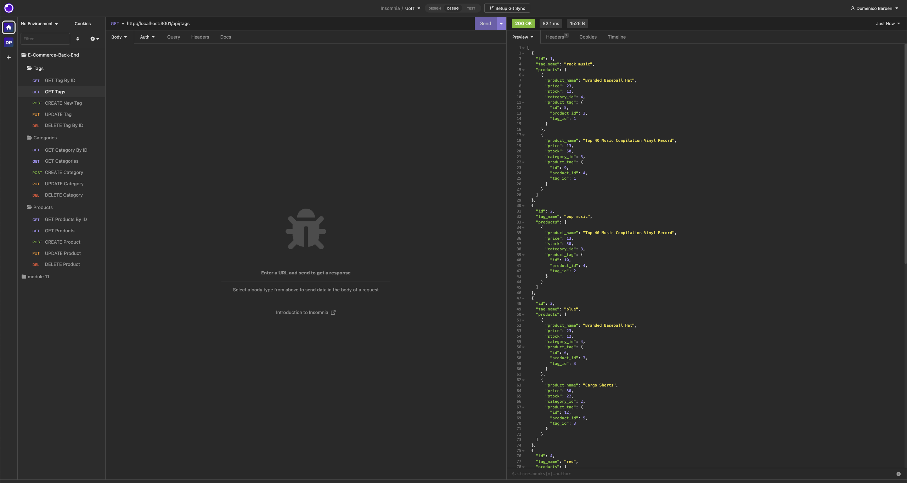

# E-Commerce-Back-End

## Description:
A back end application for an e-commerce site. Using Express.js (Node.js), dotenv, and Sequelize to interact with a MySQL database.

## Table of Contents:

* [Installation](#installation)
* [Usage](#usage)
* [Screenshot](#screenshot)
* [Demo](#demo)
* [License](#license)
* [Questions](#Questions)
* [Email](#Email)
* [Github](#Github)
* [Owner](#Owner)

## Installation:

1. Clone repository locally.
2. Type "npm i" into your terminal (within the E-Commerce-Back-End folder) to install dependencies.
3. Change the name of the .env.example file to just .env
4. Change the contents of the new .env file, refer to comments within file for further instruction

## Usage:

1. Type "mysql -u root -p" (if you have a password, if not remove the "-p") into the terminal and then type "source ./db/schema.sql" to create a database.
2. Then type the command "npm run seed" in the terminal to seed the database.
3. Type "node server" to run the application.
4. Use Insomnia to interact with the database.

## Screenshot:

## Demo:
https://user-images.githubusercontent.com/119437696/228036870-3459bc7b-0655-4d3a-91c7-d3cc0da9758d.mp4

## License

This project is licensed under the MIT license. Click [here](https://opensource.org/licenses/MIT) for more information. 

## Questions:
## Email:
If you have any questions email me directly at DomenicoABarberi@gmail.com.

## Github:
Please visit my [GitHub](https://github.com/DomenicoBarb) to view my other work.

## Owner:
Nico Barberi
